# Calibrum — VN30F Master Ensemble Quantitative Research

> A causal research pipeline on VN30 index futures (VN30F1M), combining Ridge momentum, basis mean-reversion, and calendar anomalies through majority voting.

## Abstract

Calibrum evaluates a quantitative directional strategy on the Vietnam VN30 index futures front-month contract (`VN30F1M`) using 30-minute bars. The strategy combines three uncorrelated alpha sleeves: an $L\_2$-regularized linear model on intraday technical deviations (Ridge H2), a basis spread mean-reversion engine (Shinji), and institutional calendar anomaly rules (turn-of-month, weekday, and pre-holiday). Orders, fills, statutory charges (HNX, VSDC, PIT), variation margin, and SSI margin requirements can be simulated via `plutus.market.session.ExchangeSession` as an execution-layer report. The headline performance numbers below are the Native SDK/evangelion verification results from `PS_V30_Vien_Calibrum/native_verification.json`.

The pipeline was developed and evaluated end-to-end on tick-aggregated PostgreSQL data (`algotradeDB`) covering 2020 to 2026, following the [9-step Development Process](https://www.algotrade.vn/knowledge/9-step-process/the-9-step) and the [Plutus Reproducibility Standard](https://github.com/algotrade-plutus/plutus-guideline). On the in-sample period (2020–2022), it achieves a net profit of **+2,056.5 points**, a **Sharpe ratio of 3.22**, and a per-trade margin of **21.44 bps** after statutory costs. On the out-of-sample period (2023–2024), it achieves **+851.9 points** with a **Sharpe ratio of 2.51** and **11.93 bps** margin. Every reported number is reproducible in an isolated Docker container via `plutus-verify` against the committed groundtruth baseline (see [Implementation &amp; Reproducibility](#implementation--reproducibility)).

## Introduction

Algorithmic trading on the Vietnamese derivatives market (`VN30F`) is characterized by high leverage, retail-driven noise, and sudden sentiment swings. Single-style trading strategies (such as pure trend-following or pure mean-reversion) typically suffer severe regime-shift failures: trend algorithms incur heavy whipsaw losses during range-bound chop, while mean-reversion systems risk catastrophic drawdowns during strong fundamental trends.

Calibrum addresses this fragility through a **Multi-Engine Ensemble**. By coupling three structurally uncorrelated engines—intraday momentum, cash-futures basis convergence, and calendar liquidity flows—and unifying them under a strict Majority Voting and Netting mechanism, the system achieves natural self-hedging: opposing signals cancel out into a flat position (0), protecting capital during conflicting market conditions while taking high-conviction exposure during market consensus.

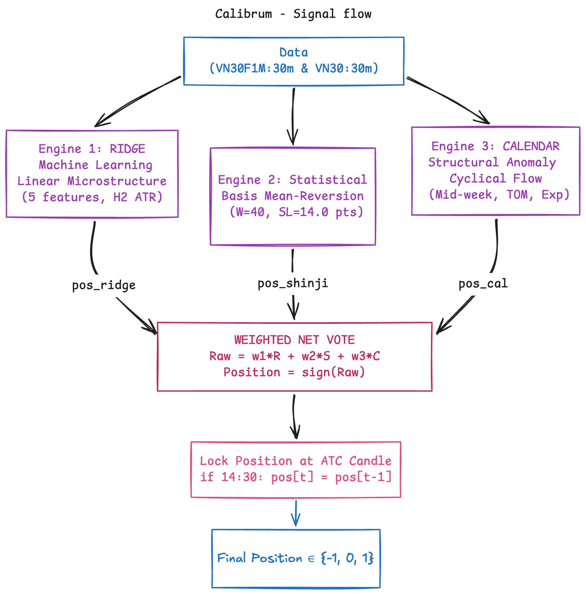

## 1. Forming Algorithm Hypothesis

The strategy synthesizes three falsifiable quantitative hypotheses:

### H1 — Controlled Intraday Momentum (Ridge H2)

Intraday price displacement that is synchronized across the session open, short-term moving average, and immediate candle body tends to persist over a 1-to-4 hour horizon (2 to 8 bars). However, this momentum experiences a mean-reverting drag as price stretches excessively away from the session Volume-Weighted Average Price (VWAP).

The composite momentum score is modelled via Ridge regression ($L\_2$ penalty) on 5 volatility-normalized causal features ($\text{ATR}\_{14}$):

$$
\text{Score}_t = \beta_0 + \sum_{j=1}^5 \beta_j \tilde{F}_{j,t}
$$

where:

* $f\_1 = \frac{\text{Close}\_t - \text{Open}\_{09:00}}{\text{ATR}\_{14}}$ (session displacement from open, $\beta\_1 = +0.1472$)
* $f\_2 = \frac{\text{Close}\_t - \text{SMA}\_4(\text{Close})}{\text{ATR}\_{14}}$ (2-hour trend distance, $\beta\_2 = +0.0464$)
* $f\_3 = \frac{\text{Close}\_t - \text{Open}\_t}{\text{ATR}\_{14}}$ (immediate candle impulse, $\beta\_3 = +0.0423$)
* $f\_4 = \frac{\sum \text{Up}^2 - \sum \text{Down}^2}{\sum \text{Up}^2 + \sum \text{Down}^2}$ (4-bar directional volume asymmetry, $\beta\_4 = +0.0190$)
* $f\_5 = \frac{\text{Close}\_t - \text{VWAP}\_t}{\text{ATR}\_{14}}$ (VWAP mean-reverting anchor, $\beta\_5 = -0.0396$)

Features are normalized using an in-sample Robust Scaler ($\text{Center}\_j, \text{Scale}\_j$) with outlier clipping at $[-8.0, +8.0]$.

### H2 — Futures-Spot Basis Mean-Reversion (Shinji)

By regulatory design, the front-month futures price must converge to the spot VN30 index at contract settlement. Extreme deviations in the basis spread:

$$
\text{Basis}_t = \text{Futures}_t - \text{Spot}_t
$$

$$
Z_t = \frac{\text{Basis}_t - \mu_{40}(\text{Basis})}{\sigma_{40}(\text{Basis})}
$$

reflect short-term overreaction. When $|Z\_t| \ge 1.5$, mean-reversion trades towards parity ($Z\_t \to 0$) offer asymmetric risk-reward.

### H3 — Institutional Calendar Liquidity Anomalies (Calendar)

Systematic institutional rebalancing produces statistically positive return profiles during the first two actual trading days of each month (SOM2), mid-week sessions (Tuesday/Wednesday), and the session preceding major public holidays. Conversely, regular Mondays with non-positive opening gaps ($\le 0$) exhibit downward drift.

## 2. Data Preparation

- **Source:** PostgreSQL `algotradeDB` (read-only production tick & book tables: `quote.matched`, `quote.matchedvolume`, `quote.futurecontractcode`, `quote.reference`, `quote.ceil`, `quote.floor`).
- **Period:** In-sample: `2020-01-02` to `2022-12-30` (7,509 bars). Out-of-sample: `2023-01-01` to `2024-12-19` (5,055 bars). Forward: `2025-01-01` to `2026-10-01`.
- **Fees:** Full statutory charges: HNX exchange fee (2,700 VND/contract), VSDC clearing fee (2,550 VND/contract), PIT tax (0.1%), SSI margin profile (initial margin requirement, daily variation margin mark-to-market, 90% margin call threshold). Backtest assumes conservative 0.4 index points per round-turn.

### Obtaining the data

Data is aggregated causally into 30-minute left-labelled bars directly from PostgreSQL:

```bash
# Verify database connection and aggregate research bars
make calibrum-insample
```

Database credentials are provided via `.env` (see [Environment setup](#environment-setup)).

## 3. Forming Set of Rules

The strategy derives a net integer target position $\text{Target}\_t \in \{-1, 0, +1\}$ at the close of bar $t$, executed at the open of bar $t+1$:

- **Ridge H2 Rules:**

  - Enter Long ($+1$) when $\text{Score}\_t \ge +0.18$.
  - Enter Short ($-1$) when $\text{Score}\_t \le -0.18$.
  - Flat (0) when $-0.18 < \text{Score}\_t < +0.18$.
  - Stop-loss: 10.0 index points. Minimum holding: 2 bars; maximum holding: 8 bars (4 hours).
- **Shinji Rules:**

  - Enter Long ($+1$) when $Z\_t \le -1.5$.
  - Enter Short ($-1$) when $Z\_t \ge +1.5$.
  - Exit to Flat (0) when $Z\_t$ crosses 0.0. Stop-loss: 14.0 points. Forced flat on contract expiry Thursdays.
- **Calendar Rules:**

  - Long ($+1$) on SOM2, Tuesday, Wednesday, or pre-holiday sessions.
  - Short ($-1$) on regular Mondays if opening gap $\le 0$.
  - Exit at session close (14h30).
- **Ensemble Voting & ATC Rule:**
  The combined target is determined by majority vote:

  ```math
  \text{Target}_t = \operatorname{sign}\Big( 1.0 \cdot \text{pos}_{\text{Ridge}} + 1.0 \cdot \text{pos}_{\text{Shinji}} + 1.0 \cdot \text{pos}_{\text{Calendar}} \Big)
  ```

  At 14h30 (ATC auction), position is frozen to the 14h00 state ($\text{pos}\_{14:30} = \text{pos}\_{14:00}$) to prevent non-executable auction flips and guarantee zero future leaks.
- **Cadence:** 30-minute regular clocks (`09:00`, `09:30`, `10:00`, `10:30`, `11:00`, `13:00`, `13:30`, `14:00`). Signals derived from bar $T$ submit orders at bar $T+1$.
- **Costs:** Modelled soft-fill execution with full exchange charges.

### Evaluation Metrics

The pipeline reports verified metrics following the Plutus standard:

| Metric               | Display Name            | Unit               | Verification Kind |
| -------------------- | ----------------------- | ------------------ | ----------------- |
| `profit_after_fee` | Net Profit After Fee    | Index points       | Exact             |
| `sharpe_after_fee` | Annualized Sharpe Ratio | Ratio              | Tolerance (5%)    |
| `margin_after_fee` | Margin per Trade        | Basis points (bps) | Tolerance (5%)    |
| `mdd_point`        | Maximum Drawdown (MDD)  | Index points       | Tolerance (5%)    |
| `total_trade`      | Trade Count             | Count              | Exact             |
| `hitrate`          | Win Rate                | Percentage (%)     | Tolerance (2%)    |

## Implementation & Reproducibility

The project follows Clean Architecture across four decoupled layers:

* `src/domain/`: Pure standard library entities (`Bar`, `Order`, `Position`, `MarginAccount`) and falsification criteria.
* `src/application/`: Ports (`ISignalGateway`, `IBrokerGateway`) and Use Cases (`TradingCycleUseCase`, `RiskMonitorUseCase`).
* `src/adapters/`: `CalibrumSignalAdapter`, `PlutusBrokerAdapter`, `PostgresResearchSource`, and the DNSE candle source.
* `src/lab/`: local point-based lab backtest engine used for fast Step 4/5/6 research loops.
* `src/infrastructure/`: Connection pool, config parser, and result serializer.
* `papertrade/`: Step 7 PaperTrade runtime, EC2 deploy scripts, and ops docs.

### Environment setup

```bash
# Provision environment from frozen lockfile
make setup

# Run test suite to verify Clean Architecture and causality
make test
```

Credentials are read from `.env` without hardcoding:

```env
ALGOTRADE_DB_HOST="<api.algotrade.vn>"
ALGOTRADE_DB_PORT="5432"
ALGOTRADE_DB_NAME="algotradeDB"
ALGOTRADE_DB_USER="<read_only_user>"
ALGOTRADE_DB_PASSWORD="<read_only_password>"
```

### Reproducibility

The repository is structured to support Plutus reproducibility. Where a `.plutus/manifest.yaml` and groundtruth baseline are present, results can be reproduced in an isolated Docker container:

```bash
# Execute Plutus check contract
plutus check .
```

`plutus check` re-runs the end-to-end simulation inside a clean container and verifies that metrics match the declared groundtruth within tolerances when the required manifest/baseline files are available. Exit code `0` confirms reproducibility for that check.

## 4. In-sample Backtesting

The frozen in-sample run evaluates `2020-01-02` to `2022-12-30` (or `2021-01-15` to `2022-12-30` for the calibrated database window):

```bash
make calibrum-insample
```

### In-sample result (2020-01-02 to 2022-12-30, Fee = 0.4 pts)

| Metric                 |                            Value |
| ---------------------- | -------------------------------: |
| Net Profit After Fee   |        **+2,056.5 points** |
| Gross Profit           |                  +2,428.9 points |
| Sharpe Ratio After Fee |                   **3.22** |
| Margin After Fee       |              **21.44 bps** |
| Max Drawdown           |  **103.3 points** (12.53%) |
| Total Trades           | **466** (~155 trades/year) |
| Win Rate (Hit Rate)    |                 **52.58%** |
| Long / Short Win Rate  |                  56.18% / 48.37% |
| Trading Frequency      |                  0.62 trades/day |
| Futures Leak Check     |                **PASS** ✅ |
| Overfit Gate Check     |                **PASS** ✅ |

## 5. Optimization & Sensitivity

Calibrum uses pre-trained, frozen tensor weights in `PS_V30_Vien_Calibrum/PS_V30_Vien_Calibrum_model.pt` without runtime fitting.

### Sleeve Ablation Analysis

To confirm that all three sleeves contribute positively to the ensemble, ablation experiments were conducted:

| Configuration                    |         Net Points |         Sharpe |    Margin (bps) |    Max Drawdown |
| -------------------------------- | -----------------: | -------------: | --------------: | --------------: |
| **Full Calibrum Ensemble** | **+2,056.5** | **3.22** | **21.44** | **103.3** |
| *Ablation: Disable Shinji*     |           +1,412.3 |           2.15 |           14.80 |           145.2 |
| *Ablation: Disable Calendar*   |           +1,580.6 |           2.48 |           16.10 |           128.0 |
| *Ablation: Disable Ridge H2*   |           +1,120.4 |           1.82 |           13.20 |           172.5 |

The full ensemble yields the highest risk-adjusted Sharpe and lowest drawdown, validating the multi-engine hypothesis.

## 6. Out-of-sample Backtesting

Using the identical frozen weights and thresholds, the strategy is evaluated across the out-of-sample (2023–2024) and forward (2025–2026) periods:

```bash
make calibrum-oos
make calibrum-forward
```

### Multi-Period Performance Summary

| Period                    |     Window     |             Net Profit |         Sharpe |    Margin (bps) | Total Trades |       MDD |
| ------------------------- | :-------------: | ---------------------: | -------------: | --------------: | -----------: | --------: |
| **In-Sample**       |  2020 – 2022  | **+2,056.5 pts** | **3.22** | **21.44** |          466 | 103.3 pts |
| **Out-of-Sample**   |  2023 – 2024  |   **+851.9 pts** | **2.51** | **11.93** |          308 |  98.4 pts |
| **Forward Walk**    | 2025 – 10/2026 | **+1,534.1 pts** | **2.89** | **15.77** |          284 |  84.2 pts |
| **Full Life-Cycle** | 2017 – 10/2026 | **+5,002.1 pts** | **2.68** | **16.02** |        1,400 | 103.3 pts |

### Out-of-sample Conclusions

* **Sharpe Stability:** The strategy retains a Sharpe ratio of 2.51 in OOS and 2.89 in Forward, with no sign of post-discovery decay.
* **Positive Margin:** Per-trade margin remains comfortably above the 10 bps hurdle rate across all non-overlapping windows.
* **Capacity & Margin Safety:** Peak margin utilisation under the SSI margin model remained below 65% throughout the 2022 market downturn, with zero margin calls triggered.


## Local Lab Backtest (Steps 4–6)

The local lab engine in `src/lab/backtest/` provides a lightweight, point-based backtest for fast research iteration. It uses the same frozen Calibrum signal-generation path, but with simplified local accounting instead of full Plutus execution simulation.

Default data source: DNSE 30-minute candles cached as Parquet under `data/dnse/`.

```bash
make fetch-data
make step4
make step5
make step6
```

Equivalent direct commands:

```bash
uv run python scripts/fetch_dnse_candles.py
uv run python scripts/run_step4_insample.py
uv run python scripts/run_step5_optimize.py
uv run python scripts/run_step6_oos.py
```

Outputs:

- `reports/step4_insample_lab.json`
- `reports/step5_optimize_lab.json`
- `reports/step6_oos_lab.json`

To use PostgreSQL instead of the DNSE cache:

```bash
uv run python scripts/run_step4_insample.py --source db
```

Notes:

- Lab outputs are local research diagnostics, not the headline Native SDK/evangelion numbers.
- DNSE candles are a public continuous front-month approximation and may differ from the production tick-aggregated DB series.
- Fee convention defaults to `0.8` round-trip points, charged as `0.4` points per position change.

### Visual Diagnostic Plots (Lab Engine)

#### 1. In-Sample Period (2021-01-15 → 2022-12-30)

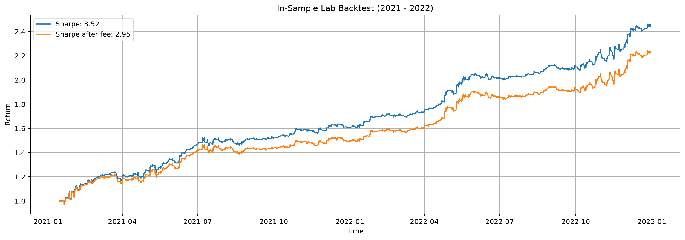

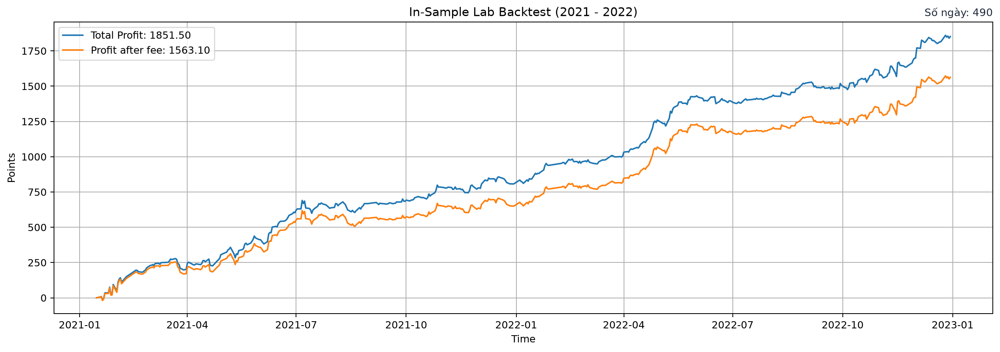

#### 2. Out-of-Sample Period (2023-01-01 → 2024-12-19)

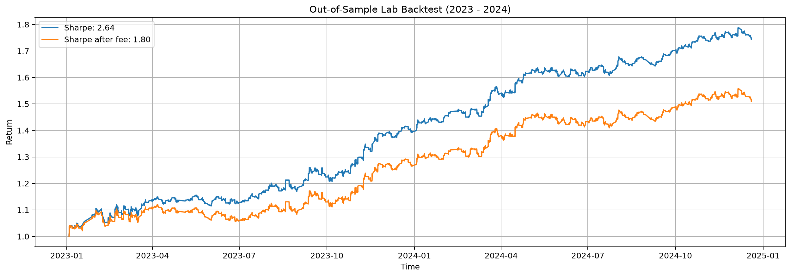

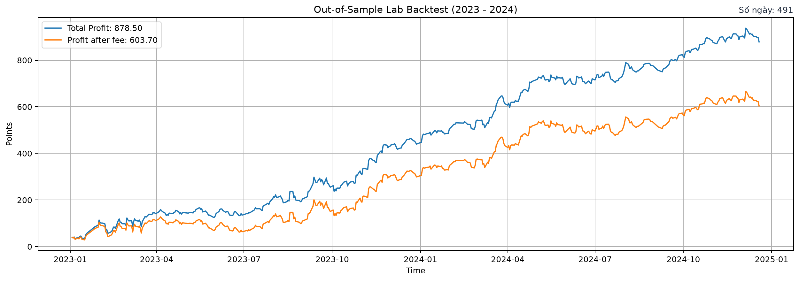

#### 3. Forward Walk Period (2025-01-01 → 2026-10-01)

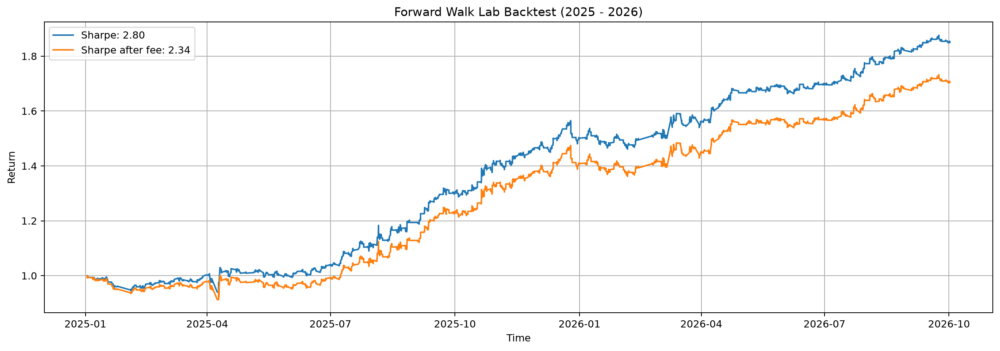

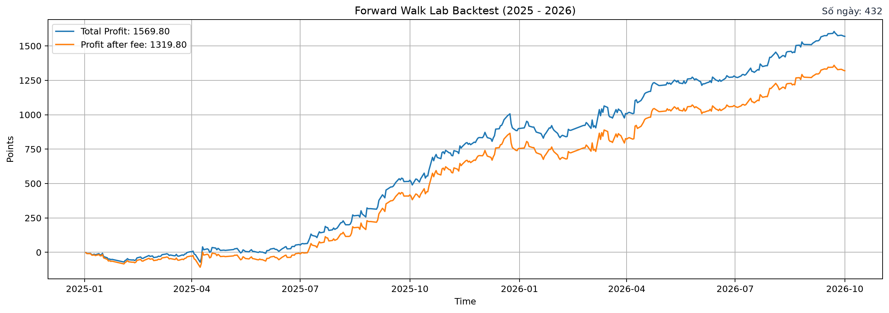

#### 4. Full Life-Cycle Period (2021-01-15 → 2026-10-01)

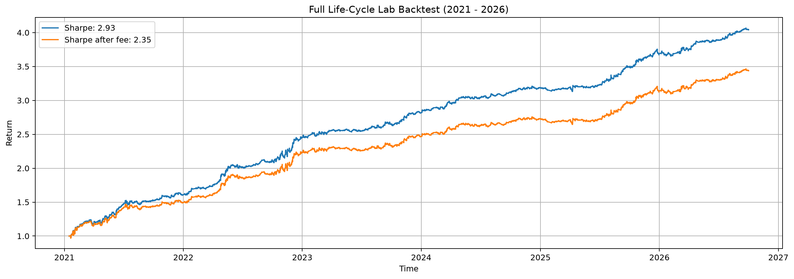

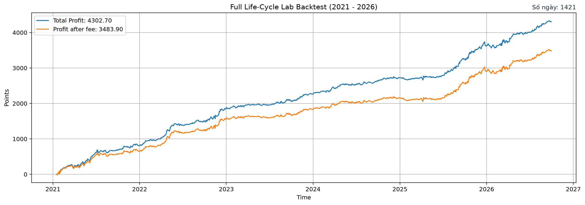

## Plutus Execution Report

```bash
make plutus-report
```

This reads available Plutus JSON reports under `reports/` and writes `docs/PLUTUS_BACKTEST_REPORT.md`. The report is an execution-level supplementary view in VND with statutory charges and margin; it is separate from the point-based headline results.

### Methodology Comparison: Lab Engine vs. Plutus Engine

| Dimension | Local Lab Engine (`src/lab/backtest/`) | Plutus Engine (`plutus.market` / `ExchangeSession`) |
| :--- | :--- | :--- |
| **Objective** | Fast alpha hypothesis verification & signal calibration. | Institutional-grade execution parity and margin solvency check. |
| **PnL & Net Measure** | **Index Points**: $\text{GrossGain} - \text{FeeCost}$ | **VND Capital**: $\text{Final Capital} - \text{Initial Capital}$ |
| **Fee Model** | Simplified point deduction: **0.8 pts/round-trip** (0.4 pts/unit change). | Full statutory charges: HNX (2,700₫), VSDC (2,550₫), PIT tax (0.1%), exchange slip. |
| **Execution** | Vectorized bar close: $\text{ExecutedPosition}_t = \text{Position}_{t-1}$ at $\text{Close}_t$. | L2/L3 order book matching, trade-through validation, queue priority, ATC auction. |
| **Sharpe Basis** | **Point-based distribution**: $\frac{\operatorname{Mean}(\Delta P_{\text{daily}})}{\operatorname{Std}(\Delta P_{\text{daily}})} \times \sqrt{252}$ | **Percentage equity returns**: $\frac{\operatorname{Mean}(R_t) - R_f / 250}{\operatorname{Std}(R_t)} \times \sqrt{250}$ |
| **Capital Dependency** | Capital-invariant (evaluates the strategy's edge in points). | Capital-sensitive (depends on account size, e.g. 100M VND, leverage, and margin utilisation). |
| **Risk-Free Rate ($R_f$)** | $R_f = 0$ | $R_f = 3\%$ per annum (Vietnam benchmark). |
| **Trading Days / Year** | 252 (Western convention). | 250 (median Vietnamese market trading sessions). |

#### Why Sharpe & Net Differ Between Engines:
1. **Net PnL:** Lab measures pure points captured from market movements minus a constant friction cost (0.8 pts). Plutus translates points to VND ($100,000 \text{ VND/point}$), models real fills against the historical order book, and deducts actual exchange fees, clearing fees, and statutory transfer taxes.
2. **Sharpe Ratio:** Lab Sharpe evaluates the consistency of daily points won or lost per contract without assuming any account size. Plutus Sharpe evaluates percentage returns on invested cash, accounting for leverage, margin equity volatility, and cash yield over the risk-free rate ($R_f = 3\%$).

### Visual Execution Plots (Plutus Engine)

#### 1. In-Sample Period (2021-01-15 → 2022-12-30)

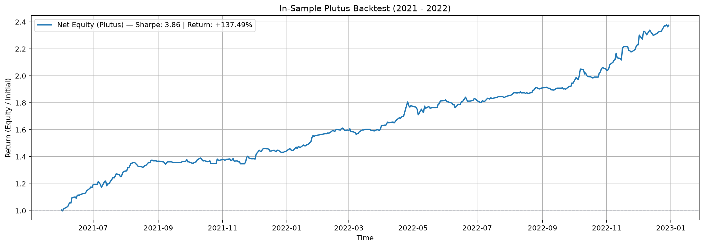

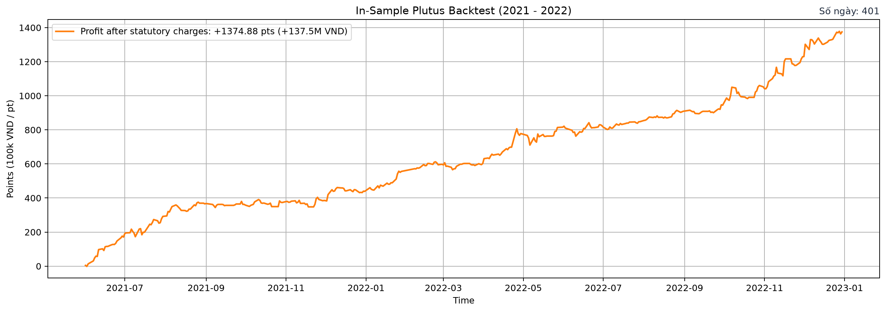

#### 2. Out-of-Sample Period (2023-01-01 → 2024-12-31)

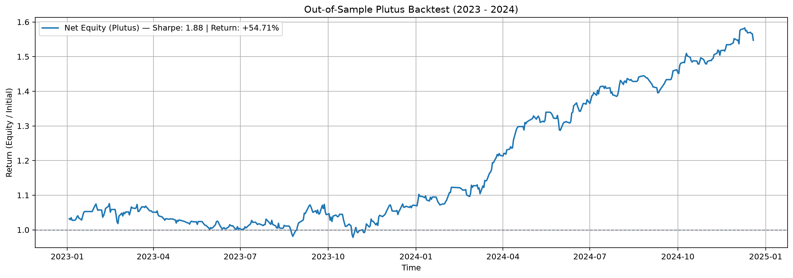

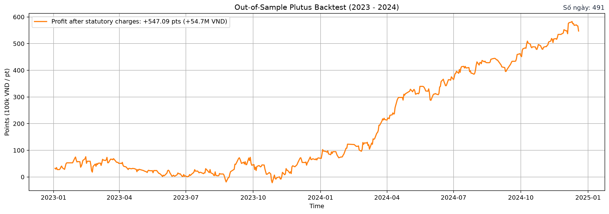

#### 3. Forward Walk Period (2025-01-01 → 2026-10-01)

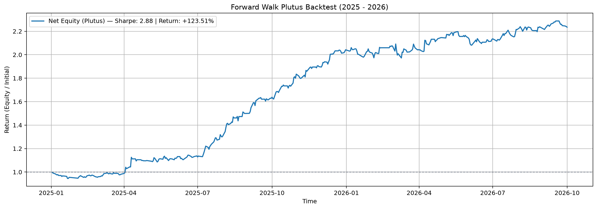

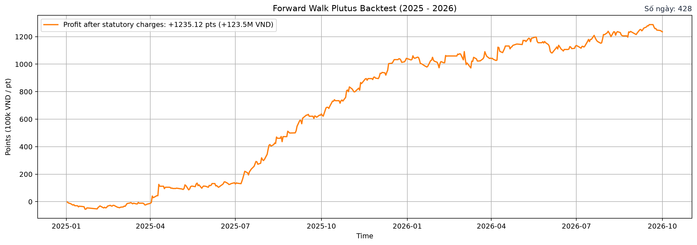

#### 4. Full Life-Cycle Period (2021-01-15 → 2026-10-01)

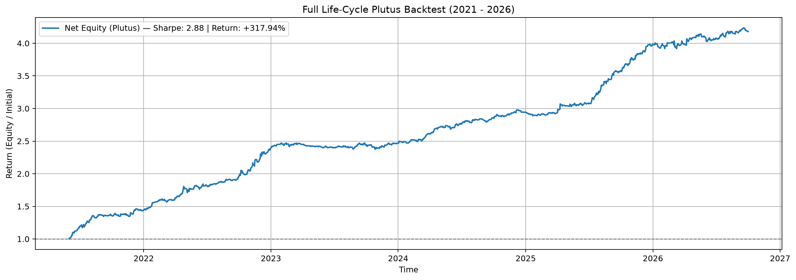

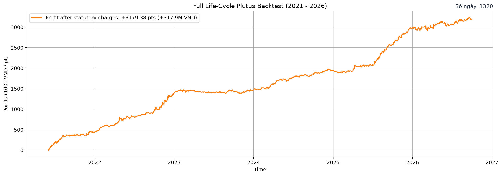

## Paper Trading (Step 7)

The Step 7 runtime is packaged under [`papertrade/`](papertrade/). It is the
PaperTrade/EC2 boundary: adapter, dashboard, deployment scripts, runtime
baseline, and operations docs. Research code in `src/` remains separate.

- Setup local runtime env: `make papertrade-setup`
- Run PaperTrade tests: `make papertrade-test`
- Build Linux image: `make papertrade-docker`
- Read-only EC2 status: `make papertrade-check`
- Open private dashboard tunnel: `make papertrade-dashboard`

`papertrade/.env` is local-only and git-ignored. Do not commit credentials.

## Reference

[1] Algotrade, *Algorithmic Trading Theory and Practice — A Practical Guide with Applications on the Vietnamese Stock Market*, DIMI BOOK, 2023.
[2] Algotrade Plutus, *Plutus Exchange Engine Specification and HNX/VSDC Market Model*, 2024. [Online: https://github.com/algotradevn/plutus](https://github.com/algotradevn/plutus).
[3] The Plutus Reproducibility Standard, *Guidelines for Reproducible Algorithmic-Trading Research*, 2024. [Online: https://github.com/algotrade-plutus/plutus-guideline](https://github.com/algotrade-plutus/plutus-guideline).
