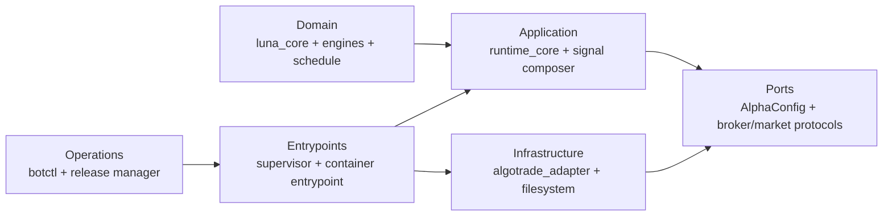

# Clean architecture cho runtime PaperTrade — P1 đến P6

## Quyết định kiến trúc

Hệ thống tiếp tục chạy một bot trên một EC2. Không thêm Kubernetes, queue,
database vận hành hoặc microservice. Mục tiêu của clean architecture ở đây là
biết rõ code nào quyết định tín hiệu, code nào được chạm broker, trạng thái nào
là nguồn chuẩn và cách rollback khi một bước thất bại.

Production hiện vẫn dùng release baseline immutable
`ec2-baseline-observable-20260924-015c4e1b1be0`. Refactor trong working tree
không tự động trở thành production và không được hot-patch lên container.

## Luật phụ thuộc

Các mũi tên biểu thị phần bên ngoài được phép phụ thuộc vào phần bên trong.
Domain không đọc env, không ghi file, không gọi REST/FIX/Kafka và không biết
Docker/EC2. `runtime_core` không import `paperbroker`. Adapter không quyết định
target chiến lược. Ops không import hoặc sửa state nội bộ của signal engine.

Không đặt Python package dưới `papertrade/runtime/`: thư mục đó trở thành mount
`/app/runtime` ở production, nên Docker sẽ che khuất code. Package ứng dụng dùng
tên `runtime_core`; còn `runtime/` chỉ chứa snapshot/DB/warmup động.

## Bản đồ source chuẩn

| Layer | Vị trí | Trách nhiệm |
|---|---|---|
| Domain | `luna_core/`, `alphas/market_schedule.py`, `alphas/master_unified/*_engine.py`, `schedule.py` | Hàm tín hiệu thuần, bar và lịch |
| Application | `runtime_core/`, `signal_composer.py` | Config typed, authorization, reconcile result, phối hợp target |
| Broker infrastructure | `algotrade_adapter/` | Workaround SDK, validate lệnh, REST/FIX/Kafka |
| Runtime interface | `alpha.py`, `supervisor.py`, `scripts/container_entrypoint.py` | Callback SDK, lifecycle, wiring dependency |
| Operator interface | `scripts/botctl.py`, `deploy/aws/release_manager.py` | Status, deploy transaction, rollback, backup |
| Read-only UI | `dashboard/` | Chỉ render snapshot đã whitelist |

`service.py` tiếp tục là compatibility facade. Các factory đang dùng trên AWS
không đổi tên. Alias cũ chỉ bị xóa sau khi không còn release/state nào dùng.

## Luồng runtime chuẩn

1. Entrypoint load release identity và mode.
2. Factory load toàn bộ cấu hình không secret một lần thành
   `MasterUnifiedRuntimeConfig`; validate quantity, rollover, timeout và profile.
3. Supervisor resolve symbol rồi dựng adapter, market data và alpha bằng
   dependency injection.
4. Adapter giữ static order gate đóng cho đến khi startup reconcile hoàn tất.
5. Reconcile phân biệt rõ `flat`, `non-flat` và `unknown`; malformed/REST error
   không bao giờ được hiểu là danh sách rỗng.
6. Strategy nhận bar/context, trả target và reason; nó không submit lệnh.
7. Alpha chuyển delta target thành order intent. Adapter kiểm tra lại static
   gate và authorization động ngay tại `place_order`.
8. Health/activity ghi snapshot đã whitelist. Dashboard và `botctl` cùng đọc
   schema này.

## Kế hoạch P1–P6 và trạng thái

| Bước | Kết quả cần có | Trạng thái hiện tại | Điều kiện hoàn tất |
|---|---|---|---|
| P1 — Source baseline | Snapshot đúng code EC2, source map và diff classification | Hoàn tất | `botctl source` mở đúng source production; manifest hash khớp |
| P2 — Immutable artifact | Image pin digest, lock dependency, không mount code | Hoàn tất | `IMMUTABLE_MATCH`, code mounts = 0, rollback image còn giữ |
| P3 — Observability | Status/source/compare, activity và dashboard read-only | Hoàn tất phần cốt lõi | Terminal/dashboard cùng release, target, position, orders và freshness |
| P4 — Runtime boundaries | Typed config, control, reconcile, health; strategy thuần | Đang làm local | Contract test cũ giữ nguyên; mọi submit đi qua một dynamic gate; startup fail closed |
| P5 — Operations/recovery | Deploy journal, backup/restore plan, pause/halt/activate | Deploy transaction đã có; control/backup còn thiếu | Crash rehearsal, backup nhất quán, command idempotent, rollback về HOLD |
| P6 — Migration | Baseline rồi refactor release, nghiệm thu qua phiên | Baseline đã chạy; refactor chưa deploy | Observe → quantity được duyệt → decision window → close/restart/reconnect đều đạt |

### P4 — thứ tự triển khai

1. **Config:** `runtime_core/config.py` là nguồn typed duy nhất cho config không
   secret của master-unified. Fingerprint không chứa credential/account ID.
2. **Reconcile:** `runtime_core/reconcile.py` chuẩn hóa position/order và trả
   kết quả có trạng thái unknown. Calendar chỉ dùng chung primitive; không bị ép
   đổi semantics trong cùng commit.
3. **Control:** `runtime_core/control.py` xác thực release ID, config hash,
   quantity và generation. Record thiếu/hỏng/mismatch chặn submit.
4. **Final broker gate:** `ValidatedPaperClient.place_order()` kiểm tra static
   gate và authorizer động mỗi lần gọi. Không cache quyết định ACTIVE.
5. **Observability:** logic release/activity nằm trong `runtime_core`; facade cũ
   trong adapter tồn tại tạm để tương thích.
6. **Alpha split:** sau khi các boundary trên ổn định mới tách tiếp lifecycle,
   evaluation và execution khỏi `alpha.py`. Mỗi lần tách phải giữ factory và
   acceptance fixtures.

### P5 — command và state ownership

| Dữ liệu | Writer duy nhất | Reader |
|---|---|---|
| `control/desired.json` | `botctl`/host controller | runtime |
| `control/halt.json` | runtime hoặc controller khi có incident | runtime, botctl |
| `control/ack.json` | runtime | botctl/dashboard |
| `runtime/health.json` | container entrypoint | healthcheck, botctl, dashboard |
| `runtime/account.json` | account exporter | botctl, dashboard, deploy preflight |
| `runtime/activity.jsonl` | activity recorder | botctl, dashboard |
| strategy checkpoint | đúng alpha đang sở hữu symbol | alpha đó |
| deploy journal | release manager | botctl/recovery |

`pause`, `halt`, `flatten` và `activate` là command có generation. Chúng không
sửa secret và không restart service chỉ để đổi trạng thái. `halt` ghi latch
trước khi cancel; `flatten` chỉ giảm vị thế quản lý bằng priced LIMIT. Tắt
service không được báo là account phẳng.

Backup dùng SQLite backup API cho DB đang mở, copy atomic JSON/state sau khi
quiesce writer, rồi ghi manifest/hash. Restore luôn khởi động HOLD và reconcile
broker trước khi cấp authorization mới.

### P6 — cutover refactor

1. Build từ clean checkout, chạy unit/contract/characterization tests.
2. Build Linux `amd64`; import `quickfix` và `paperbroker-client==0.2.8`.
3. Push ECR, lấy digest, tạo manifest và host bundle hash.
4. Deploy transaction khi REST xác nhận phẳng và 0 working orders; kết quả luôn HOLD.
5. Chạy OBSERVE qua startup/reconcile/feed. So target/reasons với baseline fixture.
6. Kích hoạt đúng release/config hash/quantity đã duyệt.
7. Quan sát ít nhất một decision window, ack/fill/reconcile và đóng phiên.
8. Đánh dấu last-good; chỉ sau đó mới loại facade/deploy path cũ.

## Contract bắt buộc

- Mọi order mutation đi qua `ValidatedPaperClient`; không giữ raw SDK reference
  ở strategy hoặc ops.
- Static gate đóng hoặc control không hợp lệ đều chặn submit.
- REST portfolio là nguồn vị thế sau restart; local tracker chỉ phục vụ xử lý
  callback và được seed/reconcile có kiểm soát.
- Foreign position, malformed response, ambiguous order, stale quote hoặc thiếu
  capacity đều chặn mở exposure mới.
- Reversal đóng vị thế cũ và xác nhận reconcile trước khi mở chiều ngược.
- Chỉ `LIMIT`/`MARKET` qua allow-list; mọi lệnh đều có numeric price và `DAY`.
- State có schema version, symbol và writer identity. Schema mới hơn không được
  reset trắng.
- Production chỉ chạy source trong image pin digest; writable mounts chỉ dành
  cho runtime/state/logs/control.

## Kiểm chứng

Ba lớp test được giữ tách biệt:

1. Pure tests cho schedule, engines, composer, config, control và reconcile.
2. Contract tests với fake SDK cho final gate, capacity, duplicate order,
   partial fill, restart và reversal.
3. Release rehearsal cho deploy interruption, ownership lock, backup/restore và
   rollback HOLD.

Không dùng kết quả backtest để chứng minh execution an toàn. Không dùng
dashboard healthy để chứng minh broker/account healthy.

## Definition of done

Clean architecture hoàn tất khi production refactor đạt đủ các điều kiện sau:

- source identity `IMMUTABLE_MATCH`, không code mount;
- effective config có hash và không chứa secret;
- một execution owner, không watchdog cạnh tranh;
- startup/reconnect reconcile ra kết quả xác định;
- mọi submit bị chặn bởi static gate và authorization động;
- `botctl` thực hiện được status, pause, halt, activate, deploy, rollback và
  backup với operation/generation rõ;
- restore và rollback đã diễn tập về HOLD;
- release refactor qua decision window thực tế mà không drift target/order;
- tài liệu vận hành trỏ đúng code production và rollback path.
