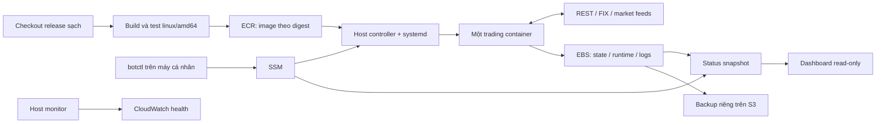

# Thiết kế vận hành PaperTrade ổn định trên một EC2

Ngày: 2026-09-24. Trạng thái: baseline quan sát đã deploy lên AWS ở forced HOLD.

**Quyết định đã được chủ dự án xác nhận:** đợt đầu giữ hành vi của EC2 hiện tại. Các thay đổi chiến lược local được duyệt và phát hành riêng.

### Trạng thái triển khai hiện tại

| Hạng mục | Trạng thái có bằng chứng |
|---|---|
| Inventory và source production | Hoàn tất read-only; 23/23 path khớp hash, gồm bốn Python hot mount |
| Mở đúng code đang chạy | `./papertrade/scripts/botctl source` trỏ tới snapshot recovered đã xác minh |
| Xem bot đang làm gì | `botctl status` hiển thị code/process/target/position/order/freshness/activity |
| Baseline immutable | Image `ec2-baseline-20260924-74f9b42fbda8` đã build/verify local |
| Baseline + observability | Release `ec2-baseline-observable-20260924-015c4e1b1be0` đã verify 25/25 file và chạy HOLD/gate đóng trên EC2 |
| Dashboard | Active, API/health trả 200 và chỉ bind `127.0.0.1:8080` |
| Deploy/rollback | Transaction đã chạy đủ preflight REST, backup, switch, forced-HOLD và post-verify |
| Strategy local | Vẫn tách khỏi baseline production; chưa phát hành |
| AWS production | `IMMUTABLE_MATCH`, không còn code mount hay systemd drop-in legacy |

Mục tiêu ưu tiên là nhìn vào một nơi và biết chính xác: code production nằm ở đâu, EC2 đang chạy release nào, cấu hình nào có hiệu lực, bot đang tính gì và đã làm gì. Sau đó mới tới cập nhật có kiểm soát, dừng đúng nghĩa và khôi phục có bằng chứng. Không thiết kế cho mở rộng số máy hay số tài khoản.

## 1. Phạm vi và tiêu chí thành công

Kiến trúc đích giữ một EC2, Docker và systemd. Một tiến trình duy nhất được sở hữu kết nối thực thi lệnh. Dashboard read-only là giao diện quan sát trực quan; `botctl status` là giao diện chẩn đoán chính xác. Quản trị qua SSM; dashboard chỉ publish loopback.

Hoàn thành khi:

1. Một lệnh `status` cho biết đường dẫn source local của release, Git SHA, image digest, source mounts, factory/config thực tế, chế độ, quyền giao dịch, hợp đồng, target, vị thế, lệnh chờ, freshness và lý do gần nhất.
2. Checkout đúng release trên máy cá nhân cho ra đúng source đã đóng gói trên EC2; local có thể tiếp tục phát triển mà không cần luôn giống production.
3. Deploy không copy đè source vào container; lỗi giữa chừng không tạo ra hỗn hợp code cũ/mới hoặc hai bot cùng gửi lệnh.
4. Restart, reboot và rollback không tự xóa HALT, không bỏ qua reconcile, không tự nâng quyền đặt lệnh.
5. Bot đang chạy nhưng không đủ điều kiện giao dịch phải hiển thị đúng trạng thái. Dashboard hỏng không chặn đường thực thi lệnh; cùng dữ liệu vẫn đọc được bằng `botctl status`.
6. Có diễn tập rollback, khôi phục backup và tình huống mất phản hồi broker.

Không bổ sung Kubernetes, ECS migration, load balancer, multi-region, database server cho control plane, message broker nội bộ, Discord bot/webhook hay notification service mới. Kafka/Redis/Postgres đang dùng làm nguồn dữ liệu bên ngoài được giữ theo baseline thực tế.

“Ổn định” ở đây là hành vi dự đoán được và phục hồi được, không phải cam kết không bao giờ downtime. Một EC2 vẫn là một điểm lỗi; chấp nhận khoảng dừng để khôi phục thay vì xây HA.

## 2. Những gì đã kiểm tra và những gì chưa xác minh

Đã đọc source local, Dockerfile, scripts deploy, systemd units, adapter, alpha, dashboard và tài liệu compatibility. Git HEAD lúc khảo sát là `848bd19`; working tree có sửa đổi chưa commit.

| Bằng chứng | Nhận xét và ảnh hưởng thiết kế |
|---|---|
| `master_unified/service.py` | Đã là facade re-export; không cần refactor lại từ một file nguyên khối theo mô tả cũ |
| `alpha.py`, `signal_composer.py`, `supervisor.py`, `bar_aggregator.py` | Đã có ranh giới tín hiệu, thực thi, lifecycle và dữ liệu bar; nên hoàn thiện dần |
| `master_unified/deploy_to_ssm.sh` | Vẫn viết source xuống host và bind-mount vào container; cần nghỉ dùng sau migration |
| `deploy/aws/run-container.sh` | Đã mount dữ liệu riêng và rootfs read-only, nhưng mặc định dùng tag `:local` |
| `Dockerfile`, `requirements.txt` | Chưa có release identity; nhiều dependency dùng khoảng phiên bản, base tag thay đổi được |
| `container_entrypoint.py` | Heartbeat riêng có thể còn chạy khi phần xử lý bên trong mắc kẹt; cần đo tiến độ worker |
| `container_healthcheck.py` | Kiểm tra heartbeat/status, chưa xác minh provenance hay readiness chi tiết |
| `algotrade-paper.service` | Docker stop 20 giây, systemd stop 30 giây; entrypoint có thể cần thêm 30 giây join sau chu kỳ 10 giây |
| `alpha.py:start()` | Có recover/cancel trước subscribe, nhưng seed position local nằm sau `super().start()`; cần kiểm tra thứ tự callback thực tế của SDK |
| `ValidatedPaperClient` | Chặn submit bằng `allow_orders`, nhưng nhiều phương thức khác forward qua `__getattr__`; không thể suy ra cancel cũng bị chặn |
| Thay đổi local chưa commit | Có seed/reconcile position và thay đổi take-profit, re-entry, gate; không được xem tất cả là refactor thuần |
| `scripts/auto_reentry_watchdog.py` chưa tracked | Có hardcode ngày/mã/image, gọi client hủy lệnh và khởi động service; cần kiểm kê xem có bản tương tự đang hoạt động trên host |
| `AWS_DEPLOYMENT.md`, `alphas/README.md` | Mô tả factory Calendar/Hybrid khác với Genesis trong transcript; tài liệu chưa đủ để kết luận factory đang chạy |

Kiểm tra read-only trực tiếp qua SSM ngày 2026-09-24 xác nhận container đang dùng image tag `v8-pg-spot-20260914`, registry digest `sha256:d79e6a...`, rồi bind-mount đè bốn file Python từ `/var/lib/algotrade`: `safe_alpha.py`, `service.py`, `genesis_engine.py`, `schedule.py`. Image không có Git revision/release label; `/opt/algotrade` không trả được Git commit và chưa có `/opt/algotrade/current`. Vì vậy identity được đánh dấu `REMOTE_DRIFT`, chưa thể ánh xạ production về một commit duy nhất.

Cùng lần kiểm tra, service/container báo active/healthy, factory runtime là `GenesisSupervisor`, target `0`, REST position rỗng, working orders `0`, và order gate đang mở. Đây là snapshot tại thời điểm kiểm tra, không phải bảo đảm cho thời điểm đọc tài liệu sau này. Chưa kiểm kê đủ cron/timers, launcher phụ và toàn bộ state schema; các mục này vẫn thuộc P0.

Kiểm thử local gần nhất: `python -m pytest papertrade/tests -q -p no:cacheprovider` bằng `.venv/bin/python`: **100 passed, 1 skipped**; skip do chưa cài QuickFIX native trên macOS. Linux image đã build QuickFIX, qua smoke HOLD và read-only REST/FIX/Kafka trên EC2. Đây chưa phải chứng nhận live execution hoặc parity đầy đủ với strategy local.

## 3. Kiến trúc đích



Trading và dashboard có unit riêng. Có thể dùng cùng một application image với entrypoint khác nhau để giảm số artifact, nhưng mỗi service pin digest và báo version riêng. Dashboard giữ read-only, không nhận credential và không có nút đặt lệnh.

Host controller là script nhỏ được version hóa, không phải một control server mới. Nó xử lý deploy, quyền vận hành, status và audit thông qua SSM. Monitor chạy bằng systemd timer, đọc metadata/snapshot theo whitelist và phát metric CloudWatch tối thiểu; quyền restart bị giới hạn vào đúng service. CloudWatch phục vụ kiểm tra hạ tầng trong AWS console, không thêm đường thông báo Discord.

## 4. Nguồn chuẩn: source, artifact, cấu hình, state

Mỗi loại có nguồn chuẩn riêng:

| Loại | Nguồn chuẩn | Không dùng làm nguồn chuẩn |
|---|---|---|
| Source | Git commit đã chốt, build context có manifest | Working tree đang sửa |
| Artifact được chạy | ECR digest + release manifest | Tag `latest`, `local`, tên ngày hoặc env `GIT_COMMIT` đứng riêng |
| Cấu hình chiến lược/vận hành | File cấu hình không secret được version hóa | Override rải rác trong shell/script |
| Credential | Secrets Manager, EC2 instance role | Git, image, dashboard, terminal output |
| Vị thế và trạng thái broker | REST portfolio + order/FIX reconciliation | Chỉ local tracker hoặc file backup |
| Strategy memory/order journal | Persistent files/SQLite có schema | Writable layer của container |
| Quyền operator đang cấp | Control record bền vững, có generation | Biến trong bộ nhớ hoặc xóa khi restart |

Source giống nhau không có nghĩa hành vi giống nhau nếu config, dependency hoặc input/state khác nhau. Bản release phải mô tả cả những yếu tố này.

### 4.1 Release identity

Hai manifest, tránh vấn đề tự tham chiếu digest:

- **Build manifest trong image:** Git full SHA, source-tree SHA256, dependency-lock SHA256, base-image digest, platform, thời gian build UTC, schema được hỗ trợ. Không chứa chính digest của image.
- **Release manifest ngoài image, tạo sau push:** release ID, ECR manifest digest, build manifest hash, config hash, host-bundle hash, kết quả test, schema compatibility và release tiền nhiệm.

Image dùng OCI labels như `org.opencontainers.image.revision` để tra cứu. Release ID có thể là `20260924T120000Z-<sha12>-b1`; image chạy bằng `repository@sha256:...`. Phân biệt registry manifest digest, Docker image config ID và digest manifest đa kiến trúc; tool phải so đúng loại. Chỉ build `linux/amd64` cho runtime này.

Docker hỗ trợ pin image bằng digest; ECR hỗ trợ chặn ghi đè tag. Dùng digest để chọn artifact và tag immutable để người vận hành dễ đọc. [Docker pull by digest](https://docs.docker.com/reference/cli/docker/image/pull/), [ECR tag immutability](https://docs.aws.amazon.com/AmazonECR/latest/userguide/image-tag-mutability.html).

Không coi env `GIT_COMMIT` do launcher truyền vào là bằng chứng đủ. `status` đối chiếu manifest trong image, inspect thực tế từ host, mounts, launcher hash và config hiệu lực.

### 4.2 Build và dependency

Build từ checkout/worktree sạch của commit đã chọn. Không stash/reset working tree người dùng. Dùng Git archive/build context có allowlist; không mang file untracked, `.env*`, dữ liệu, DB, credential, log vào build context. Source-tree hash chỉ rõ tập file được hash.

Khóa dependency production gồm phụ thuộc bắc cầu cho Linux, hash wheel vendored `paperbroker-client==0.2.8`, và pin base image digest. Giữ các workaround đã xác minh. Pin công cụ build cần thiết; lưu package inventory, wheel hashes và build log đã sanitize. Native QuickFIX phải được import/test trên Linux/amd64.

Pin Python/base chưa làm các lệnh `apk upgrade` và compiler toolchain tái lập tuyệt đối. Đợt đầu lưu artifact đã test và rollback bằng chính digest đó; không hứa rebuild luôn byte-identical. Cập nhật OS/dependency có chủ đích thành release riêng, không build khi service restart.

### 4.3 Cấu hình và quyền giao dịch

Chọn một schema cấu hình typed, dùng JSON + stdlib là đủ. Nội dung gồm factory/profile, qty/hard cap, lịch/rollover, feed routing, cửa sổ giao dịch, timeout và strategy flags. Validate ngay khi khởi động, từ chối key không biết và giá trị không hợp lệ. Hash canonical JSON chứa giá trị không secret **sau khi áp dụng defaults**.

Secret giữ qua `render-env.sh`, file `/run/algotrade/*` mode 600, thư mục 700. Chỉ phân phối key theo service; không dump toàn bộ env bằng `docker inspect`. Có thể ghi version ID không secret trong audit; không hash giá trị password/token rồi công bố. Trong migration, loại dần non-secret overrides khỏi secret; key cấu hình trùng nguồn phải báo lỗi thay vì thắng âm thầm.

Quyền thực thi tách khỏi profile. Một authorization record gắn với **release ID + config hash + qty + generation**, có chế độ cho phép. Deploy release mới làm authorization cũ không còn hợp lệ. Reboot cùng release chỉ có thể khôi phục quyền đã cấp nếu HALT không tồn tại, schema hợp lệ và reconcile/readiness đã qua; không mặc định bật.

## 5. Refactor có giới hạn, giữ hành vi đã chốt

Không viết lại framework hoặc broker integration. Dùng baseline EC2 được phục dựng ở bước P0 để kiểm chứng trước/sau. Local HEAD không tự động trở thành baseline.

| Thành phần | Trách nhiệm sau refactor | Cách thay đổi |
|---|---|---|
| `service.py` | Public factory và compatibility facade | Giữ import/factory aliases cũ |
| `bar_aggregator.py`, engines, `luna_core` | Bar, indicator, pure signal primitives | Giữ timing, đơn vị, thứ tự ưu tiên của baseline |
| `signal_composer.py` | Target và reason codes | Không network, không submit/cancel, không đọc env trực tiếp |
| `alpha.py` | Nối SDK callbacks với quyết định và execution | Giảm trách nhiệm dần; giữ facade tương thích |
| `algotrade_adapter` | Broker defects, validate order, reconcile | Giữ wrapper hiện hữu, audit đường đi có thể bypass |
| `runtime_core/config.py` mới | Load/validate effective config | Một lần lúc startup; tránh xung đột với mount `/app/runtime` |
| `runtime_core/control.py` mới | Control state, quyền submit/cancel, command ack | Được kiểm tra ở điểm gọi broker cuối cùng |
| `runtime_core/reconcile.py` mới | Startup/reconnect reconciliation có kết quả rõ | Chỉ extract phần thực sự dùng chung, không ép Calendar/Genesis cùng semantics |
| `runtime_core/observability.py` và health writer | Snapshot trạng thái và hoạt động gần nhất | API nhỏ, không gọi dịch vụ ngoài từ alpha |
| `ops/` mới | Host status, source mapping, release tooling | Không được quyết định strategy |

Không đổi package/factory names hàng loạt. Không xoá Calendar/Hybrid vì production có thể còn alias/state cần chúng. Giữ `luna_core` trong Docker context hiện tại.

Những việc phải audit kỹ khi refactor:

- SDK có bắt đầu xử lý quote trong `super().start()` trước khi seed/reconcile xong hay không. Gate đóng ở adapter cho tới khi state và subscriptions đã sẵn sàng.
- Fill callback lặp, callback đến trễ, partial-fill trong lúc cancel, REST chậm hơn FIX và timestamp khác timezone.
- Position quantity khớp chưa đủ chứng minh giá vốn/PnL đúng; không dùng seed quantity để chứng nhận tính đúng của take-profit.
- `ctx.open_orders` rỗng chưa chứng minh broker không có lệnh đang bay. Reconcile cần cả local journal và remote order evidence.
- Các method forwarded và raw SDK references có thể gửi/hủy/replace lệnh ngoài adapter; contract test phải chứng minh gate có hiệu lực trên tất cả đường mutating.
- Đánh giá các bugfix seed/reconcile local riêng bằng fixture. Không tự chép cả file vì có lẫn logic chiến lược mới.

## 6. Máy trạng thái vận hành và quyền lệnh

Giữ hai env mode hiện tại `hold`/`alpha` để tương thích. Các trạng thái dưới đây là control state của thiết kế, chưa phải tính năng hiện hữu.

| Trạng thái/lệnh | Kết nối | Submit | Cancel | Ý nghĩa |
|---|---|---|---|---|
| HOLD | Không broker | Không | Không | Kiểm tra container/supervision |
| OBSERVE | Có, theo chính sách broker | Không | Không tự động | Xem portfolio/feed, tính target, không mutate account |
| RECONCILING | REST/FIX theo nhu cầu | Không | Chỉ khi operator đã cấp recovery/cancel scope | Xử lý lệnh cũ, dựng trạng thái tin cậy |
| ACTIVE | Có | Theo strategy và mọi gate | Có, theo policy | Vận hành paper được cấp quyền |
| PAUSED | Có nếu còn chạy | Không | Không tự động | Ngừng submit mới; lệnh cũ vẫn có thể khớp |
| HALTING/HALTED | Có nếu còn chạy | Không | Chỉ lệnh bot sở hữu, có xác nhận kết quả | Khóa bền vững; không tự flatten |
| FLATTENING | Có | Chỉ giảm vị thế quản lý | Có theo scope | Target về 0, không mở chiều ngược |
| STOPPED | Không | Không | Không | Tiến trình dừng; không chứng minh account phẳng |

`PAPERBROKER_ALLOW_ORDERS=false` phải là khóa cứng cho mọi submit kể cả flatten. Cancel cần capability riêng được thiết kế và audit; OBSERVE tuyệt đối không cancel ngầm. Code startup hiện có recovery cancel nên phải tách các bước này trước khi gọi chế độ mới là read-only.

Quyền submit hiệu lực là phép AND: release/config được cấp quyền, static gate mở, control state cho phép, chưa HALT, reconcile hợp lệ, session/symbol/quote/capacity hợp lệ và không có order ambiguity. Flatten cần authorization scope riêng, vẫn bị ràng buộc bởi dữ liệu và cửa sổ giao dịch.

### 6.1 HALT, pause, flatten và stop

`halt` ghi latch bền vững trước, chặn submit mới ở adapter, rồi yêu cầu runtime cancel các lệnh thuộc bot. Trả riêng trạng thái `requested`, `submission_blocked`, `cancel_pending`, `cancel_confirmed` hoặc `unknown`. Có thể vẫn có fill của lệnh đã gửi trước thời điểm gate đóng; luôn reconcile sau cancel. Không thông báo “an toàn/phẳng” chỉ vì gửi yêu cầu thành công.

HALT được đọc qua control loop độc lập với quote và được kiểm tra lại sát lệnh submit. Mục tiêu phát hiện latch ≤2 giây khi process khỏe; đó không phải bảo đảm broker cancel trong 2 giây. Serialize submit/control transitions trong runtime, ghi thời điểm gate có hiệu lực. I/O lỗi hoặc control record hỏng => block submit.

`flatten` trước tiên latch ngăn tái vào, settle working orders, đọc REST mới, rồi dùng priced crossing LIMIT/DAY, tick 0.1 theo adapter hiện tại. Không gửi MARKET không giá. Chỉ giảm vị thế trong instrument được quản lý, không cancel/đóng vị thế lạ. Hết phiên, quote stale, capacity không đủ hoặc timeout => báo vị thế còn lại và giữ HALT. Không giả định LIMIT sẽ khớp.

`stop` cần báo vị thế/lệnh còn lại hoặc UNKNOWN trước khi dừng. Tắt service không đồng nghĩa hủy lệnh broker. Khi runtime treo, một recovery process chỉ được nhận ownership sau khi xác minh process cũ đã chết và lock được giải phóng; không mở FIX client thứ hai song song để “cứu”.

`resume`/`activate` ghi authorization mới có expected generation, release/config/qty cụ thể. Request cũ bị từ chối. Sau HALT luôn cần hành động operator rõ ràng; deploy, restart hoặc timer không có quyền tự resume.

### 6.2 Một chủ sở hữu thực thi

Dùng host lock persistent FD (`flock`) theo bot/account alias; wrapper giữ lock suốt vòng đời trading/recovery process. Có deploy lock riêng cho giao dịch cập nhật release. Đây là bảo vệ cho một host; không tuyên bố fencing đa máy.

Không chỉ dựa vào lock của Docker CLI: CLI bị ngắt có thể để container còn sống. Trước chuyển ownership phải inspect container/process thật; runtime hoặc guard giữ execution lock cùng vòng đời process trong container qua shared lock path. Test trường hợp launcher chết mà container chưa chết. Host root vẫn có thể bypass cơ chế này; các công cụ vận hành chuẩn không được tạo đường bypass.

Lập inventory systemd, timers, cron, containers và script độc lập trước migration. Vô hiệu hóa có chủ đích mọi launcher cạnh tranh sau khi thay thế. Fixed container name không đủ làm ownership guarantee. Không cho watchdog tự bật trading theo giờ hoặc qty.

## 7. Reconcile, thời gian và state

Startup chuẩn: validate identity/config/schema/control → giữ gate đóng → lấy ownership → REST portfolio/orders và local journal → FIX status/settlement khi được cấp quyền → xác nhận không có lệnh mơ hồ hoặc vị thế lạ → dựng tracker/state → subscribe và warmup → đánh giá readiness → mới xét authorization để ACTIVE.

Nếu remote orders query lỗi, không biến lỗi thành danh sách rỗng. Phân biệt “không có vị thế/lệnh” với “không biết”. Timeout sau submit được đánh dấu UNKNOWN; query bằng mã liên kết ổn định, không tự gửi lệnh thay thế. Retry submit không được dựa vào giả định broker hỗ trợ idempotency khi chưa xác minh SDK/FIX.

SDK order SQLite hiện là nguồn local order journal; tránh tạo một execution ledger thứ hai độc lập. Nếu SDK không bền vững ở khoảng crash trước/sau send, bổ sung tối thiểu intent record và recovery mapping sau khi khảo sát, kèm test crash injection. Chặn batch tiếp theo cho đến khi mọi intent trước đó được resolve.

Fill application có dedup theo identifier broker/FIX đáng tin khi có; REST reconcile xử lý thiếu/trễ. Reversal phải phẳng và xác nhận xong rồi mới mở chiều ngược. Khi reconcile vị thế, không ghi đè thiếu thông tin vào tracker để tạo cảm giác đã đồng bộ.

UTC dùng cho audit/activity; `Asia/Ho_Chi_Minh` dùng cho session. Duration/timeout dùng monotonic; ghi cả source timestamp và receive timestamp cho freshness. Clock jump, timezone không hợp lệ và lịch ngoài coverage đều là điều kiện chặn phù hợp. Lịch exchange/holiday cần nguồn chuẩn trước khi đổi; không coi lịch trong research và runtime là tương đương.

Giữ nguyên các đường dữ liệu đang dùng trong migration đầu:

```text
/opt/algotrade/releases/<release-id>/    release manifest + host bundle
/opt/algotrade/current                  con trỏ release (atomic replace)
/var/lib/algotrade/control/             operator control, authorization, acks
/var/lib/algotrade/runtime/             health.json, account.json, orders.db, warmup
/var/lib/algotrade/state/               strategy state hiện có
/var/lib/algotrade/runtime/activity.jsonl  activity sanitize, 5 MB + 2 bản rotate
/var/lib/algotrade/ops/                 deploy journal, last-good, restart budget
/var/log/algotrade/                     log có retention
/run/algotrade/                         env secret tạm thời
```

Không di chuyển `orders.db` từ runtime sang state ngay trong đợt đầu. JSON ghi temp+replace cùng filesystem, validate schema, fsync khi cần durability. State có schema version, symbol/profile, phiên liên quan, sequence/last bar và release writer. Unknown/newer schema => HOLD và báo lỗi, không reset trắng. File snapshot cũ khác instance ID không được tính là heartbeat mới.

Control desired record do host controller sở hữu; bot chỉ đọc. HALT do bot tự phát hiện được lưu bằng latch riêng; quyền hiệu lực là trạng thái hạn chế hơn của operator control và bot latch. Bot ghi ack riêng. Tránh hai writer cùng sửa một JSON. Mount control read-only vào runtime; persistent host lock/control directory do root quản lý.

## 8. Quy trình release, deploy và rollback

### 8.1 Hai bước đầu tiên để thoát hot-patch

**A — Phục dựng baseline:** lấy image digest thực tế và source files thực sự đang được import, gồm tất cả mounts/overrides; tạo source baseline có provenance. Không gán Git SHA local cho code EC2 chỉ vì tên file giống. Nếu không ánh xạ được trọn vẹn về commit lịch sử, tạo commit baseline riêng của source runtime được phục dựng và ghi rõ nguồn.

Chỉ xuất source/metadata theo allowlist; không export toàn bộ filesystem container/host hoặc raw env vì có thể kèm credential và dữ liệu tài khoản. Source files lấy về cũng phải rà soát secret trước khi commit. Tập fixture baseline phải ghi coverage và phần không đủ dữ liệu để replay; thiếu historical quote/basis không được bù bằng OHLC tương lai. Nếu không có bằng chứng cho một nhánh quan trọng, giữ cấu trúc/hành vi nhánh đó hoặc bổ sung capture/characterization trước khi refactor nó.

**B — Đóng gói baseline:** build toàn bộ source baseline vào image mới, không mount đè `.py`. Test hành vi baseline trước/sau và smoke OBSERVE. Đây là release loại bỏ drift, không đồng thời đưa take-profit/re-entry mới vào. Có thể hoàn tất refactor trong checkout và test trước, nhưng nên phát hành baseline immutable trước release thay cấu trúc sâu để có rollback đã biết.

“Giữ hành vi” nghĩa là giữ luật chọn target, timing, qty, feed routing và execution policy đã chốt. Lỗi an toàn phát hiện trong baseline được ghi thành bugfix riêng với expected behavior; không bảo tồn mù một đường gửi lệnh nguy hiểm và cũng không lén thay strategy.

### 8.2 Build một lần, triển khai đúng artifact

Build/test ngoài EC2 production từ clean worktree. Có thể dùng Docker Buildx trên máy cá nhân; không bắt buộc thêm CI để vận hành một bot. Release scripts cho phép chuyển sang CI sau này mà không đổi protocol.

Sau test, push ECR, ghi digest vào manifest rồi pull đúng digest để kiểm chứng. Không rebuild trên server. Host bundle gồm launcher/unit/controller có hash và version compatibility với app. Restart chỉ chạy image có sẵn được pin; ECR tạm lỗi không được ngăn restart một artifact đã tải và xác minh.

### 8.3 Deploy transaction

1. `plan`: đọc identity hiện tại, schema, state disk, thời gian/session, positions/orders và pending command. In release trước/sau, config diff không secret, activation bị giữ đóng.
2. Lấy deploy lock, tạo `operation_id`, ghi journal bền vững. SSM gọi host job sống độc lập với terminal; CLI mất mạng có thể query lại cùng operation, không submit job mới mù quáng.
3. Pre-pull image, verify manifest, hash host bundle, disk headroom và rollback artifact. Test import/HOLD với runtime/state **tạm riêng**, không mount cùng writable state và không mở FIX của bot đang chạy.
4. Chuyển maintenance gate, settle lệnh theo quyền đã cấp; mặc định chọn thời điểm vị thế phẳng và không còn working orders đã xác minh. “Target hôm nay = 0” không phải bằng chứng account phẳng. Nếu giữ vị thế qua deploy cần kế hoạch riêng trước khi thực hiện.
5. Stop bot cũ có timeout, xác minh container/process đã dừng và ownership đã nhả. Backup nhất quán toàn bộ state/journal/warmup/config metadata; không xóa dữ liệu.
6. Cài host bundle nếu cần, atomic switch release descriptor, launch bản mới với authorization không hợp lệ cho submit. Chạy HOLD trước để chứng minh supervision; sau đó OBSERVE để chứng minh đọc dữ liệu/reconcile readiness.
7. Verify trong thời hạn hữu hạn: identity/mounts/config đúng; heartbeat và worker progress; REST/FIX/feed phù hợp session; schema/state/warmup; foreign/unknown orders bằng 0. Ngoài giờ chưa có fresh feed phải báo `WAITING_MARKET`, không giả chứng nhận giao dịch sẵn sàng.
8. Ghi `installed_verified` và trạng thái chờ kích hoạt. Chỉ đánh dấu `last_good` theo mức bằng chứng đã đạt; baseline được chứng minh ACTIVE qua phiên có decision window là mốc riêng.
9. Operator kích hoạt release/config/qty đã xem xét; sau đó theo dõi qua cửa sổ quyết định và hết phiên. Không mở gate như side effect của deploy.

Trạng thái journal tối thiểu: PREPARING → QUIESCING → STOPPED → SWITCHED → VERIFYING → INSTALLED_VERIFIED hoặc FAILED/ROLLED_BACK/NEEDS_OPERATOR. Journal ghi cả desired và observed identity. Host reboot giữa transaction đọc lại journal, giữ gate đóng, reconcile thực tế rồi tiếp tục/recover có kiểm soát.

### 8.4 Rollback

Rollback bao gồm image digest, host bundle và non-secret config tương thích. Không tự rollback secret về bản cũ. Không đổi quyền thành ACTIVE; giữ HOLD/OBSERVE/HALT cho tới khi kiểm tra lại.

Nếu bản mới chưa mutate broker và schema cũ vẫn đọc được state, có thể trở lại last-good tự động **một lần** trong transaction. Nếu state đã migrate không tương thích, restore cần dừng writer và kế hoạch cụ thể. Khi bản mới đã gửi lệnh, không phục hồi order DB/strategy checkpoint cũ rồi tiếp tục giao dịch; broker reconciliation từ trạng thái hiện tại là bắt buộc.

Không vòng lặp new→old→new. Không xóa image last-good hoặc hot-patch backup trước khi hoàn tất migration. Giữ ít nhất ba release tốt gần nhất theo ngân sách disk; lifecycle ECR và cleanup host phải bảo vệ release đang chạy và rollback đã đánh dấu.

### 8.5 Dọn các đường deploy cũ

Sau migration được kiểm chứng, thay `deploy_to_ssm.sh` bằng thông báo nghỉ dùng hoặc wrapper tới `botctl` không còn chức năng copy source. Hợp nhất `ALGOTRADE_IMAGE`/`ALGOTRADE_IMAGE_REF`, bỏ hardcode instance/date/symbol/image khỏi scripts. Host inventory phải bao gồm `/usr/local/bin` custom launchers và systemd drop-ins; cập nhật file trong repo một mình chưa đủ.

## 9. Công cụ vận hành hằng ngày

Giao diện đích; `status`, `source`, `compare` đã được triển khai. Các lệnh còn lại là phạm vi sau migration:

```text
botctl status [--json]           code đang chạy, vị trí, activity và readiness
botctl source                   mở/checkout đúng source của release production
botctl compare                  local HEAD/dirty với release, config/mount drift
botctl logs --since 30m          log đã sanitize, có release/instance context
botctl dashboard                mở SSM tunnel hiện có
botctl release build <commit>    build/test manifest từ source sạch
botctl deploy plan <release>     preview và kiểm tra điều kiện
botctl deploy apply <release>    transaction; không tự activate
botctl operation <id>           theo dõi/recover cùng một operation
botctl pause                    chặn submit mới, báo lệnh đang còn sống
botctl halt                     latch + yêu cầu cancel bot-owned orders
botctl flatten                  yêu cầu đóng vị thế có scope rõ
botctl activate <release>        gắn quyền với config/qty cụ thể
botctl rollback <release>        trở lại release tương thích, gate đóng
botctl backup / restore-plan     backup và xem kế hoạch restore
```

`status` là sản phẩm quan trọng nhất của đợt đầu. Output mặc định phải ngắn, đọc được bằng mắt và chia thành bốn khối:

Trong lúc `botctl` chưa được triển khai, `scripts/check_live_alpha.sh` là cầu nối read-only. Script phải trả thêm object `code` chứa image ref/ID/digest, Git checkout trên host và mọi Python bind mount đè lên `/app`; có code mount thì báo `REMOTE_DRIFT`, thiếu release manifest thì báo `UNKNOWN` thay vì tự nhận `MATCH`.

```text
CODE
  release:       20260924T120000Z-abc123-b1
  git commit:    abc123... (clean build)
  local source:  /.../luna-vn30f/.worktrees/production-abc123
  EC2 release:   /opt/algotrade/releases/20260924T120000Z-abc123-b1
  image:         .../algotrade-paper@sha256:...
  code mounts:   none
  drift:         MATCH

PROCESS
  service:       active; container healthy; restarts 0
  factory:       alphas.master_unified.service:build_genesis_service
  mode/gate:     alpha / OPEN
  started:       ...; worker progress: 3s ago

BOT NOW
  session:       OPEN; symbol: HNXDS:VN30Fxxxx
  target/actual: +8 / +8; working orders: 0; unknown orders: 0
  reason:        tue_wed + t2_hold_long
  last decision: ...; next decision: ...
  FIX/feed/REST: connected / fresh 1.2s / fresh 8.4s

RECENT ACTIVITY
  ... target changed 0 -> +8 (reason ...)
  ... order submitted BUY 8 @ ... (correlation ...)
  ... filled 8/8 @ ...; position reconciled +8
```

Các giá trị trên chỉ minh họa format. Trường không xác minh được phải là `UNKNOWN`, không suy đoán. `--json` trả cùng schema để dashboard dùng, tránh terminal và dashboard diễn giải theo hai cách khác nhau.

`local source` không trỏ vào working tree nghiên cứu đang thay đổi. `botctl source` tạo hoặc tái sử dụng một Git worktree read-only theo đúng commit production, rồi in đường dẫn rõ ràng. Nếu release EC2 là baseline phục dựng chưa ánh xạ được về Git commit, tool mở snapshot source có manifest và gắn nhãn `recovered`, không giả là checkout chuẩn.

`EC2 release` là metadata/host bundle dưới `/opt/algotrade/releases/<release-id>`; source thực thi nằm trong image ở `/app`. Khi migration hoàn tất, `code mounts` phải là `none`. Nếu còn bất kỳ bind mount nào đè lên `/app/**/*.py`, status liệt kê từng ánh xạ host → container và đặt drift là `REMOTE_DRIFT`.

“Bot đang làm gì” được lấy từ state có cấu trúc, không grep log tự do. Health/activity phải ghi tối thiểu: target hiện tại, actual position, reason codes, last evaluation/decision, last order transition, working/unknown orders, feed/portfolio ages và lỗi đang chặn. Activity log là JSON Lines append-only có sequence, timestamp và correlation ID; rotation theo dung lượng, không chứa credential hoặc account ID. Đây là lịch sử quan sát ngắn hạn, không thay order journal của SDK.

Control requests là structured JSON, validate allowlist, operation ID, actor từ SSM/audit, requested-at, expected generation và expected release. Không nối raw user input vào shell. Chỉ báo thành công khi nhận observed result/ack; SSM `send-command` trả ID chưa phải deploy thành công.

`compare` phân biệt `MATCH`, `LOCAL_AHEAD`, `LOCAL_DIRTY`, `REMOTE_DRIFT`, `UNKNOWN`. `LOCAL_AHEAD` là bình thường; `REMOTE_DRIFT` là artifact/config/mounts thực tế khác release. Network/permission failure => UNKNOWN với exit code khác 0, không in “khớp”. Cho phép tạo worktree xem production release riêng để debug, không ghi đè checkout nghiên cứu.

Audit giữ command type, operation ID, actor, release/config hash, previous/new generation, timestamps và result. Không ghi secret, account identifier thật hoặc raw broker response.

## 10. Health, restart và monitoring

Tách bốn câu hỏi: process còn sống; worker còn tiến triển; dependencies/readiness có đủ; operator có cấp quyền giao dịch. Ngoài giờ/nghỉ trưa phải có session-aware states thay vì báo thiếu tick sai ngữ cảnh.

Snapshot đề xuất gồm schema version, release/build identity, runtime instance ID, mode, control state/generation, configured/effective order permission, strategy/factory, symbol, qty, actual/desired position, working/unknown orders, reason codes, last evaluation, last completed bar, quote source/receive age, portfolio age, FIX state, warmup readiness, disk/state errors và next decision.

Health payload hiện dùng `healthy/running/degraded`; giữ compatibility trong migration và thêm trường có version. Dashboard render UNKNOWN/stale rõ ràng, không giữ màu xanh từ snapshot cũ.

| Tín hiệu | Mặc định thiết kế ban đầu | Hành động |
|---|---|---|
| Heartbeat | Mỗi 10s; quá 45s là stale như hiện tại | Monitor ghi nhận, grace startup và maintenance riêng |
| Worker progress | Tick loop mỗi ≤5s, cả ngoài giờ | Quá 60s hiển thị stale; quá 120s xem xét deadlock recovery |
| Feed/portfolio freshness | Giữ ngưỡng baseline trong migration | Block theo policy trước submit; hiển thị theo session |
| FIX disconnect | Block submit ngay | Reconnect/reconcile; không restart liên tục vì lỗi broker |
| UNKNOWN order, foreign position, schema hỏng | Không chờ timer | HALT/block, báo rõ lý do và cần thao tác gì |
| Disk | Warn <20%; critical <10% hoặc <1 GiB | Chặn release mới; lỗi ghi journal chặn submit, không tự xóa state |
| Restart budget | Tối đa 3 lần/15 phút | Sau ngưỡng giữ HALT và hiện lỗi, chờ operator |
| Host/system check | Giữ CloudWatch recovery alarm hiện có | Xem trong AWS; không thêm notification relay |

Đây là giá trị xuất phát cần đo thực tế; thay freshness giao dịch so với baseline là policy change phải được ghi riêng.

systemd là chủ restart duy nhất, Docker `--restart=no`. Docker health trạng thái unhealthy không tự chứng minh rằng systemd sẽ restart; cần monitor/exit policy rõ. Docker restart policy phản ứng theo vòng đời container, không thay thế application readiness. [Docker HEALTHCHECK](https://docs.docker.com/reference/dockerfile/#healthcheck), [Docker restart policy](https://docs.docker.com/engine/containers/start-containers-automatically/).

Phối hợp ba lớp timeout: các network call có timeout hữu hạn; app shutdown mục tiêu ≤40s; Docker stop 60s; systemd stop 75s là cấu hình đề xuất để test. Chuyển vòng sleep heartbeat sang interruptible event. Forced kill phải để dấu unclean shutdown và bắt reconcile lần sau. Không coi các con số này là bảo đảm khi chưa diễn tập.

Restart budget và maintenance state phải bền vững, không reset chỉ vì monitor restart. Monitor không bật service operator đã STOP, không restart trong deploy, không tự recover HALT do rủi ro. Docker/service supervision và app risk gates phục vụ hai mục tiêu khác nhau.

Giữ CloudWatch system-recovery alarm hiện có cho lỗi hạ tầng EC2. Không xây EventBridge/Lambda/Discord relay trong phạm vi này. Nếu sau này cần push notification, nó là hạng mục tùy chọn và chỉ đọc cùng status schema.

## 11. Dashboard và activity log

Dashboard trả lời nhanh “bot đang làm gì”; terminal trả lời sâu “vì sao và code nào đang chạy”. Cả hai đọc cùng một status schema. Dashboard thêm khối **Code đang chạy** ở đầu trang:

- Release ID, Git short SHA và image digest rút gọn.
- Trạng thái `MATCH`, `REMOTE_DRIFT` hoặc `UNKNOWN`.
- Factory/profile, mode, order gate và configured quantity.
- Thời điểm start, restart count và last worker progress.
- Nút copy lệnh `botctl source`/`botctl status`; không mở source hay chạy command từ web server.

Khối **Bot đang làm gì** hiển thị target/actual, reason codes, last evaluation, next decision, working/unknown orders, FIX/feed/REST freshness và last blocking error. Khối **Hoạt động gần đây** chỉ lấy các transition quan trọng: lifecycle, target change, submit, broker acknowledgement, partial/full fill, cancel, reconcile và risk block. Không ghi mỗi quote.

Activity record có `schema_version`, sequence, UTC/ICT timestamp, runtime instance, release/config hash, type, severity, reason/correlation và payload whitelist. Writer không được chờ network; lỗi ghi activity làm status mất lịch sử nhưng không làm callback giao dịch treo. Các order transition quan trọng vẫn dựa vào journal/reconcile, không dựa duy nhất vào activity log.

Giữ activity trong ba file tối đa khoảng 15 MB (file hiện tại 5 MB và hai bản rotate). Đây là lịch sử vận hành ngắn hạn phù hợp một bot; không cần database activity riêng. `botctl logs` dành cho traceback/debug chi tiết; dashboard không render raw log hoặc raw broker payload. Writer và reader đều dùng whitelist; key/text có dạng password, token, secret, credential, account ID, AWS key, JWT hoặc URL có credential bị loại/redact ở boundary.

## 12. Backup, bảo mật và bảo trì

Backup cần cả strategy state, warmup, SQLite order journal, FIX persistence nếu có, control/HALT, release manifest, host bundle và config không secret. Inventory P0 xác định mọi đường ghi thực tế, không chỉ ba thư mục dự kiến.

Trước deploy: dừng/quiesce writer rồi backup nhất quán. Hằng ngày: dùng SQLite backup API cho DB đang mở; không copy một mình file `.db` bỏ qua WAL. Snapshot nhiều file cần checkpoint/manifest chung; phải chỉ rõ mức nhất quán. Mã hóa backup trên S3, private, IAM giới hạn prefix; không kèm secret env. Backup chỉ nằm trên cùng EBS không giải quyết mất volume.

Mặc định giữ 7 bản ngày + 4 bản tuần, cùng các backup migration/last-good cần thiết. Mục tiêu RPO dữ liệu local ≤24h với backup ngày, RTO khôi phục thủ công ≤60 phút sau khi có host/network/credential — chỉ chấp nhận sau restore drill, không phải SLA đã đo. Broker history/reconcile có thể giảm mất dữ liệu lệnh nhưng không thay thế strategy state đầy đủ.

Restore thử trong container HOLD với dữ liệu bản sao, không nhận credential đặt lệnh. Khi thay EC2 phải fence/stop host cũ trước khi cấp quyền host mới. Restore control về HALT, verify hashes/schema, REST/FIX reconcile rồi mới xét resume. Backup cũ không ghi đè thực tế broker.

Giữ EC2 role, no inbound Security Group, SSM và dashboard loopback. Runtime non-root/read-only; giảm capabilities theo test compatibility. Dashboard không nhận secret. Không auto-update package trên production giữa phiên. Review dependency và base image định kỳ bằng release có test.

Log rotation riêng cho Docker, application/FIX logs, journal và activity log; Docker log limits không tự giới hạn các file bind-mounted. Status phải hiển thị lịch trading hết coverage, expiry/rollover, backup quá hạn và certificate/credential nếu có hạn dùng đã biết.

## 13. Kế hoạch thực hiện và điều kiện qua từng bước

Ước lượng là ngày làm việc tập trung, không bao gồm chờ phiên thị trường hoặc xử lý sai lệch chưa biết; khoảng 8–13 ngày kỹ thuật cộng quan sát ít nhất hai phiên phù hợp. Ưu tiên điều kiện nghiệm thu, không gộp bước để kịp một ngày bot dự kiến FLAT.

| Bước | Việc làm | Đầu ra | Điều kiện hoàn thành |
|---|---|---|---|
| P0 — Inventory, 0.5–1 ngày | Read-only EC2: mounts, digest, launcher/drop-in hashes, factory/config whitelist, schemas, timers/cron/processes, state paths, positions/orders | `baseline-inventory.json`, source snapshot, danh sách sai lệch/unknown | Biết đầy đủ code/config có hiệu lực; có đường rollback cũ; không lộ secrets |
| P1 — Source baseline, 1–2 ngày | Dựng worktree/snapshot đúng production, replay/characterization và phân loại diff local | Baseline commit/snapshot, source map, acceptance matrix | Mở được đúng code production; tách strategy changes khỏi cấu trúc và bugfix |
| P2 — Immutable baseline, 1–2 ngày | Build manifest, lock deps, digest release, host bundle, compare; rehearsal deploy offline | Image baseline + release manifest + rollback package | Linux/FIX import, clean build context, không mount code, smoke HOLD/OBSERVE |
| P3 — Quan sát, 1–2 ngày | `botctl status/source/compare`, code identity, activity timeline và dashboard cùng schema | Một màn hình sự thật cho code/process/bot activity | Terminal/dashboard thống nhất; source mount lạ luôn hiện REMOTE_DRIFT |
| P4 — Refactor và control, 2–3 ngày | Config, gates, ownership, reconcile, state schema, pause/halt/flatten | Runtime được kiểm thử, giữ public facade | Parity baseline đạt; restart/ambiguity/kill tests đạt |
| P5 — Deploy/backup, 1–2 ngày | Deploy transaction, health monitor, backup/restore và rollback | Runbook/CLI và recovery đã diễn tập | Deploy gián đoạn không tự bật gate/tạo hai writer; restore HOLD đạt |
| P6 — Migration và nghiệm thu, 1 ngày + phiên quan sát | Cutover tuần tự baseline immutable rồi bản refactor; dọn đường cũ sau kiểm chứng | Release last-good, evidence log và tài liệu cập nhật | Quan sát đủ startup/reconnect/decision window; gate/qty đúng quyền được cấp |

P2–P4 có thể được phát triển xong local trước cutover, nhưng thứ tự triển khai lên EC2 vẫn giữ baseline immutable làm mốc. Status/dashboard và backup có thể nghiệm thu trước cutover runtime. Không chạy hai alpha broker-connected cùng tài khoản để so sánh; shadow comparator chỉ chạy pure signals offline trên input ghi lại.

Mỗi bước có commit/release riêng, không gộp thay đổi `lab/`, report nghiên cứu, take-profit/re-entry hoặc tuning vào runtime migration. Không reset các thay đổi local của người dùng.

## 14. Ma trận kiểm chứng bắt buộc

| Tình huống | Kết quả phải quan sát được |
|---|---|
| Replay baseline vs refactor | Target, reason, decision timing và order plan khớp trên cùng information set |
| Research khác runtime | Không tuyên bố full parity; giữ khác biệt ghi trong `DATA_CONTRACT.md`/`PARITY_REPORT.md` |
| Working tree dirty / untracked source | Release build từ commit không bị nhiễm file local; compare báo đúng |
| Image tag trỏ sang bản khác | Runtime vẫn chọn digest đã pin; không silent upgrade |
| Env SHA giả / source mount lạ / launcher đổi | Drift check thất bại hoặc UNKNOWN, không MATCH |
| OBSERVE có pending orders | Không submit/cancel ngầm; báo cần reconcile có quyền |
| HALT khi quote ngừng | Control vẫn có ack/gate block, không chờ quote mới |
| Submit đồng thời HALT | Không submit sau thời điểm block đã xác nhận; order đang bay được theo dõi |
| Cancel timeout và partial fill | Không báo canceled/flat khi chưa có xác nhận; không duplicate order |
| Crash trước/sau gửi lệnh hoặc mất ACK | Resolve intent/order state trước retry; UNKNOWN chặn batch mới |
| Duplicate/out-of-order fill và REST lag | Không double-count; không ghi đè state đang có ambiguity |
| Restart với vị thế overnight | Tracker/reconcile sẵn sàng trước evaluation; không mở dư |
| Broker query lỗi | UNKNOWN, không giả danh sách rỗng hoặc actual=0 |
| Flatten quote stale/hết phiên/vị thế lạ | Không gửi lệnh không hợp lệ; báo residual rõ, giữ latch |
| Hai launcher/recovery process | Chỉ một process lấy được ownership thực thi |
| Deploy ngắt tại mọi phase | Journal giúp phục hồi; không mixed release hoặc tự activate |
| Rollback sau state mới/order mới | Block schema không tương thích; reconcile broker, không restore mù |
| Health thread sống, worker treo | Worker progress alarm; restart có budget, latch giữ nguyên |
| Nghỉ trưa/cuối tuần | Không báo feed stale sai kỳ vọng; readiness không giả ACTIVE |
| Rollover/lịch hết hạn | Giữ invariants hợp đồng/phẳng/lịch; không quản lý nhầm mã |
| Dashboard dừng hoặc snapshot stale | `botctl status` vẫn đọc được; dashboard hiện UNKNOWN sau khi quay lại |
| Source local khác production | `botctl compare` báo LOCAL_AHEAD/LOCAL_DIRTY; `botctl source` mở đúng release |
| Activity log rotate/hỏng | Bot không treo; status hiển thị gap; order state vẫn lấy từ journal/reconcile |
| Disk đầy / SQLite busy / JSON hỏng | Fail closed cho journal/control; không reset dữ liệu |
| Restore trên host/container mới | HOLD, data integrity/schema đúng, host cũ fenced trước activation |
| Tất cả output/log | Không chứa password, token hoặc account identifier thật |

Test fake-client phục vụ edge cases; integration Linux/FIX phục vụ compatibility; OBSERVE phục vụ kết nối thật; phiên paper có activation phục vụ execution thật. Không dùng kết quả của một lớp để tuyên bố lớp khác đã đạt.

## 15. Các điểm phải xác minh ở P0, không cản việc chốt thiết kế

1. Digest và toàn bộ source mounts thật, runtime factory, cấu hình strategy/quantity đang có hiệu lực.
2. Có cron/watchdog/launcher ngoài repo và tài khoản đang bị client khác quản lý hay không.
3. SDK persistence, order identifiers, recovery semantics, FIX storage path và mức đầy đủ của REST history.
4. State schema thực tế và khác biệt baseline EC2 với local HEAD/working tree.
5. Nguồn feed spot đang dùng, timestamps và lịch exchange áp dụng; tránh suy từ tên image.
6. Dung lượng EBS, backup hiện có, ECR lifecycle, SSM/IAM và CloudWatch alarms thật.
7. Độ dài history và bố cục dashboard sau khi có dữ liệu thực tế; không ảnh hưởng source identity/status schema.

Quyết định mặc định đã chốt: một EC2, ECR digest, systemd, SSM, một writer, dashboard read-only, không Discord, giữ hành vi EC2 trước. Các thông tin chưa biết được ghi UNKNOWN; không biến giả định thành bằng chứng production.

Tài liệu hiện hữu cần cập nhật sau implementation: `AWS_DEPLOYMENT.md`, `alphas/README.md`, `COMPATIBILITY.md` nếu phát hiện workaround mới, và runbook deploy/rollback/status. Bản thiết kế này không thay đổi kết luận nghiên cứu trong `docs/PARITY_REPORT.md`.
